## Import pre anotated polygon-segmetaion into Label studio

**Цель туториала:** *разметить данные на одном компьютере, направить их колеге и чтоб он смог открыть их у себя.*

### Установим label-studio

###Requires Python >=3.8
```
pip install label-studio
```

Добавим переменные окружения для label-studio

**Назначим переменую окружения чтоб label-studio мог загружать файлы с локального хранилища**
```
export LABEL_STUDIO_LOCAL_FILES_SERVING_ENABLED=true
```

**Назначим переменую окружения для label-studio, которая указывает корневой путь загрузки**
```
export LABEL_STUDIO_LOCAL_FILES_DOCUMENT_ROOT=/Users/Sergey/Documents/Projects/label_studio
```

### Запустим сам label-studio
```
cd /Users/Sergey/Library/Python/3.9/bin
# run label-studio
./label-studio
```

### Разметим данные:

Создадим проект
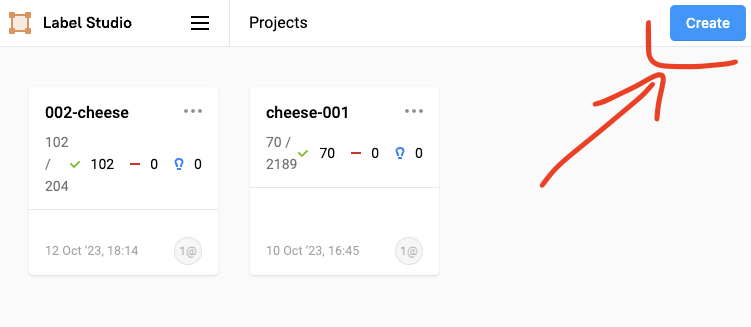

Сделаем название


Выберем нужный тип разметки
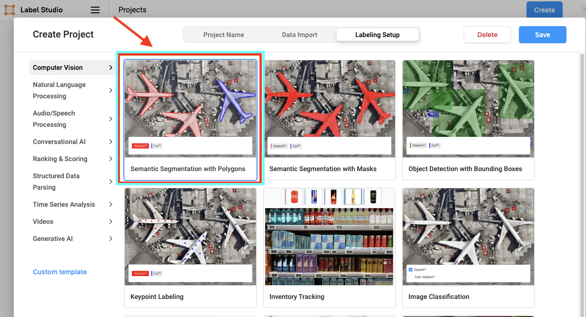

Настройка разметки
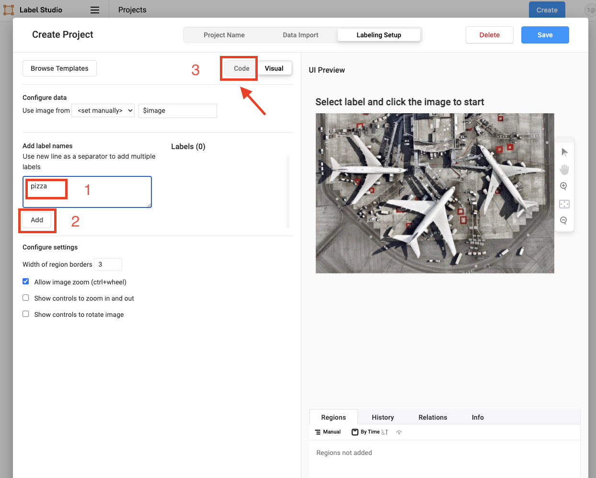

Так же саму анатацию, классы можно загруить из конфига текстового файла
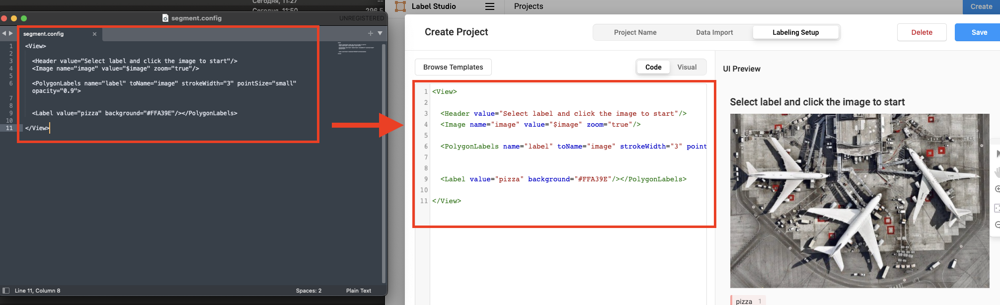


Теперь импортируем файлы из локальной директории

т.к. label_studio видит корневую директоиию которую мы предустановили, будут доступны пути/директории только внутри нее
```
export LABEL_STUDIO_LOCAL_FILES_DOCUMENT_ROOT=/Users/Sergey/Documents/Projects/label_studio
```

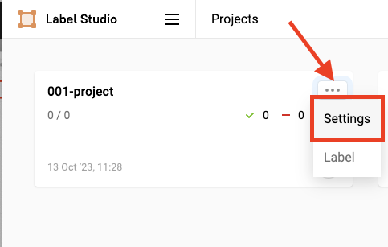

Добавим файлы хранящиеся локально
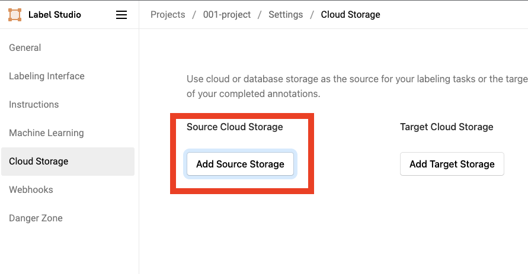
Путь  
```
/Users/Sergey/Documents/Projects/label_studio/prepared_data/001_preanotated_polygon_segmentaion
```
Регулярка если несколько изображений file regex
```
.*jpg|.*png
```
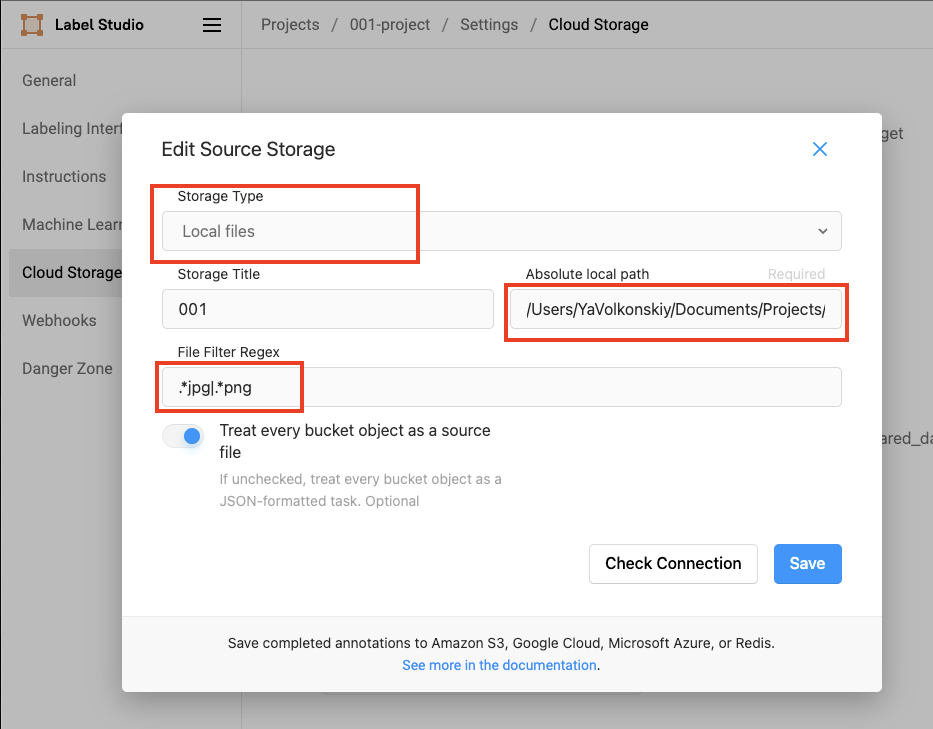

Зайдем в сам проект
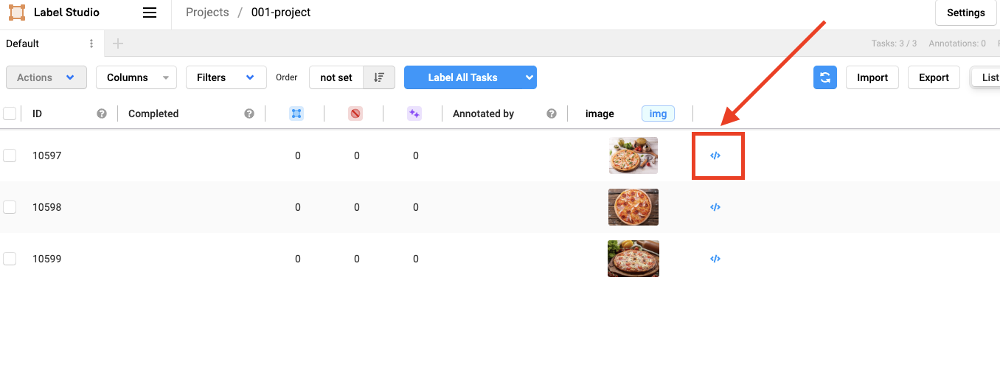

Посмотрим на саму антоацию-разметку
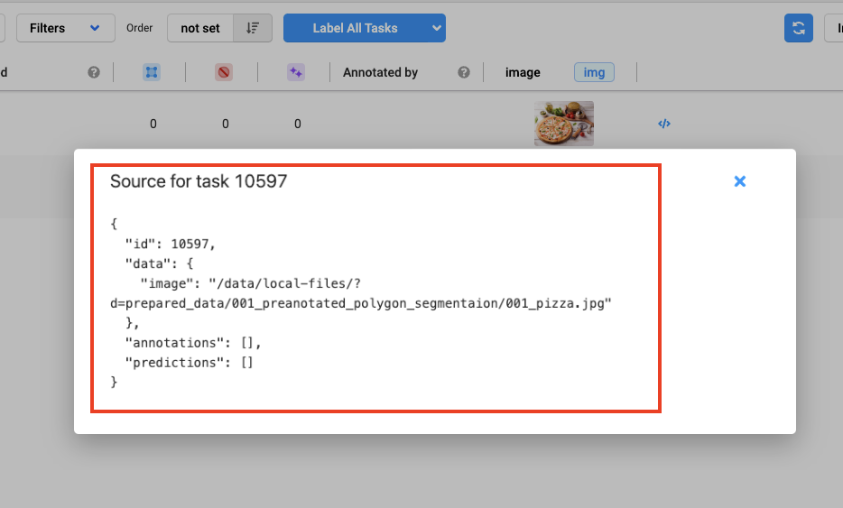


Произведем разметку
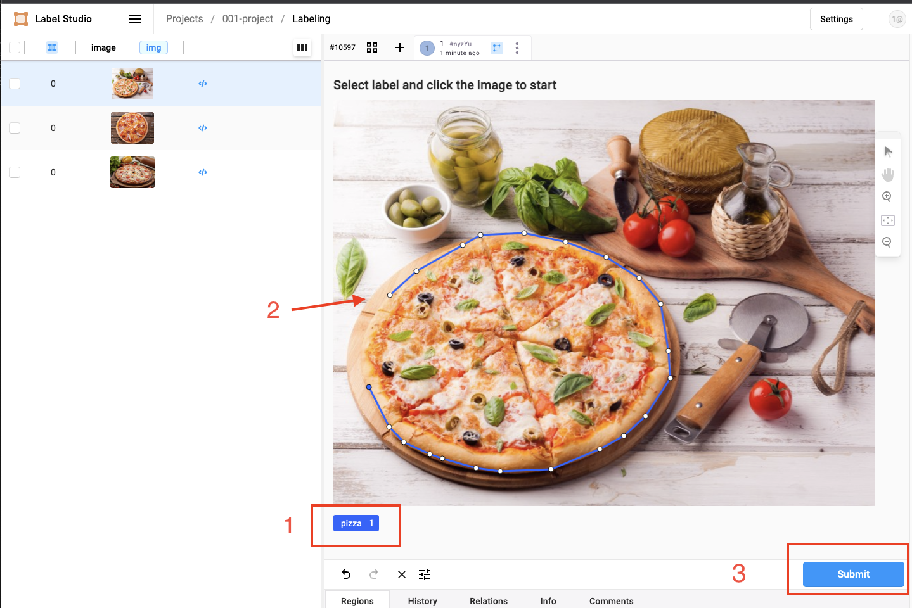


Экспортируем данные разметки в формате Label-studio
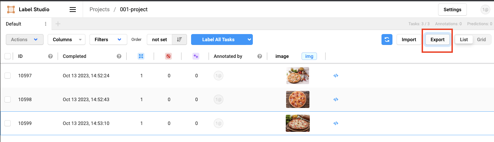

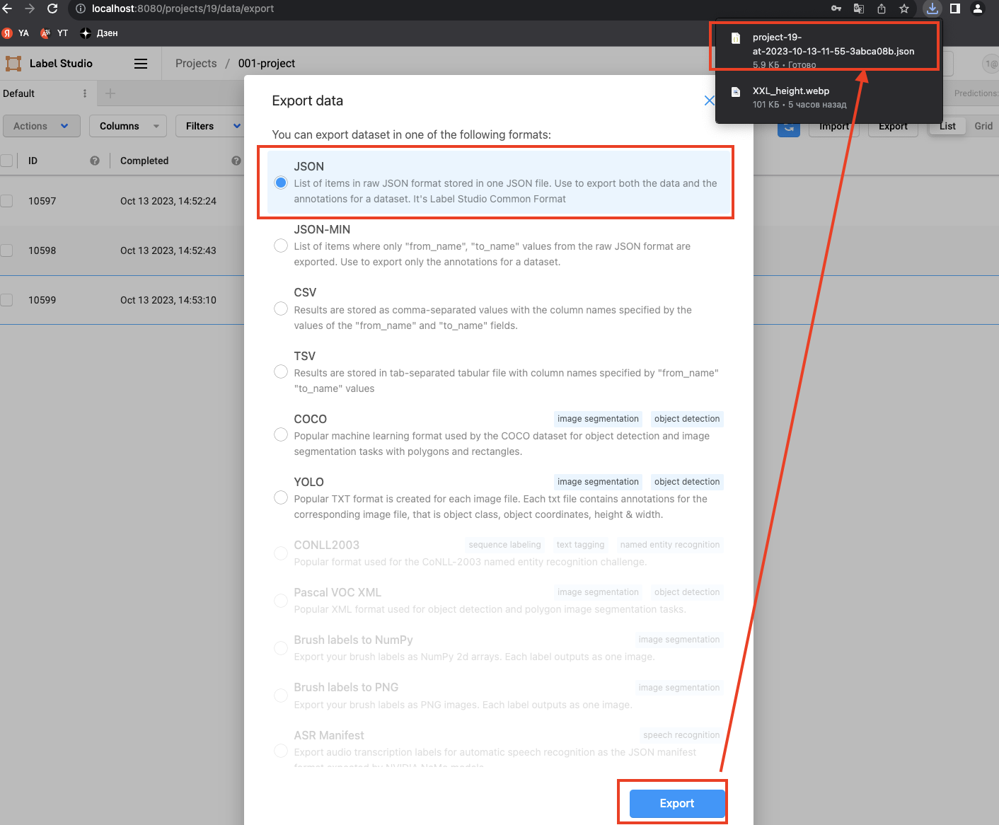

Основной параметр по которому можно будет в дальнейшем подгрузить разметку на другом пк это путь

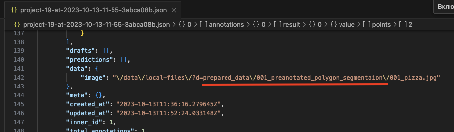
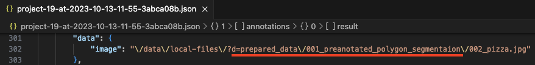
```
            "image": "\/data\/local-files\/?d=prepared_data\/001_preanotated_polygon_segmentaion\/002_pizza.jpg"
```
После знака "равно" local-files\/?d=, идет путь который начинаеться с =>
```
"\/data\/local-files\/?d=
```
После
LABEL_STUDIO_LOCAL_FILES_DOCUMENT_ROOT=/Users/Sergey/Documents/Projects/label_studio

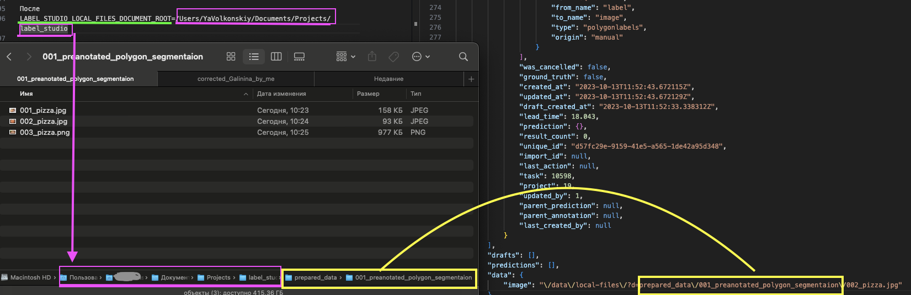

### Теперь направляем другому человеку данные  
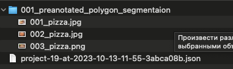

Сохраняем данные по заданному пути:
```
/Users/Sergey/Documents/Projects/downloded
```
### Теперь направляем другому человеку данные  
  
Полный путь будет: */Users/Sergey/Documents/Projects/downloded/exported/001_preanotated_polygon_segmentaion*  
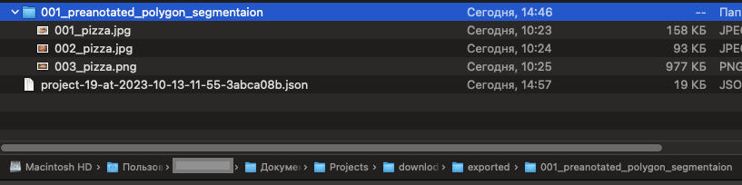

Импортируем нвоый путь на другом компьютере в верхнюю папку куда положили данные: папка с изображенями + сама файл разметки формата Label-studio
```
export LABEL_STUDIO_LOCAL_FILES_DOCUMENT_ROOT=/Users/Sergey/Documents/Projects/downloded
```
### Запустим сам label-studio
```
cd /Users/Sergey/Library/Python/3.9/bin
# run label-studio
./label-studio
```

По аналогии создаем проект как в предыдущих шагах:

Заходим в настройки проекта
и вставляем путь на локальные файлы как:
```
/Users/Sergey/Documents/Projects/downloded/exported/001_preanotated_polygon_segmentaion
```


Добавляем config anotation:  
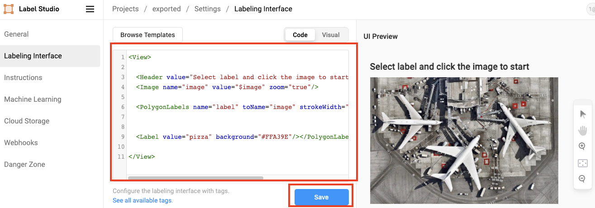

Редкатируем файл анотаций:
```
project-19-at-2023-10-13-11-55-3abca08b.json  
```  
Т.к переменная окружения корневого пути была: 
```  
export LABEL_STUDIO_LOCAL_FILES_DOCUMENT_ROOT=/Users/Sergey/Documents/Projects/downloded 
```   
Кончается downloded  
А путь вставленный в UI  
```  
/Users/Sergey/Documents/Projects/downloded/exported/001_preanotated_polygon_segmentaion
```  
Рахница в этих путях:  
```  
/exported/001_preanotated_polygon_segmentaion
```  
Меняем  anotation в формате label-studio под новый путь:  
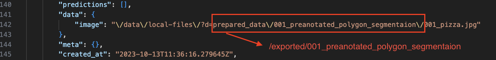

```  
prepared_data\/001_preanotated_polygon_segmentaion\/    =>
exported/001_preanotated_polygon_segmentaion/
```  

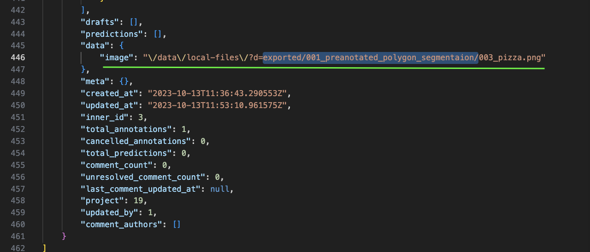
Заменим путь автоматически во всей разметке  

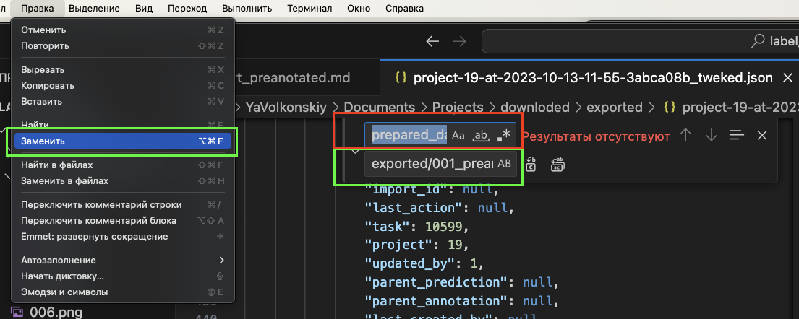  
Импортируем данную разметку:  
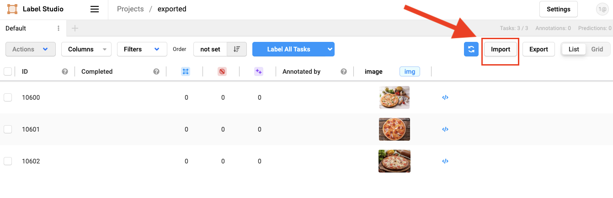
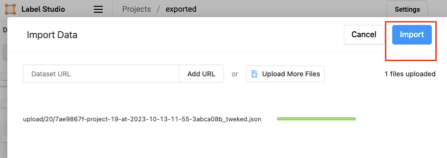  
Данные подгрузились:
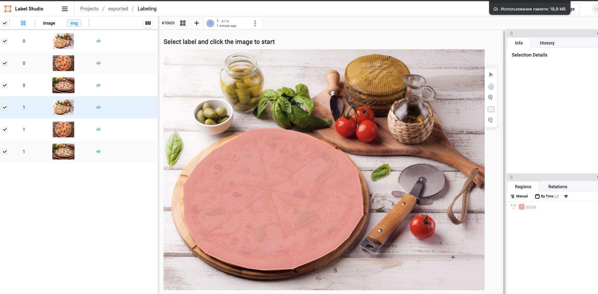
