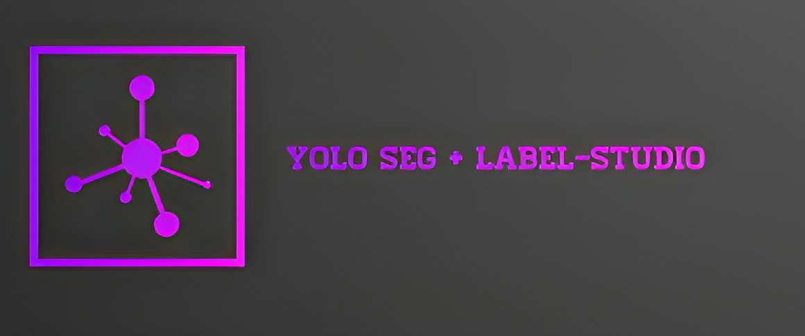

# This script make inference YOLOv8 segment and convert it to Label-Studio Poject



You need to fill-up **config.yaml**  
- weight trained model YOLOv8 - segmentation
- folder with images to input
- out label-studio file

# run comand
```python
python3 main.py
```