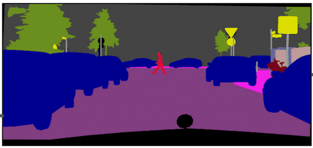
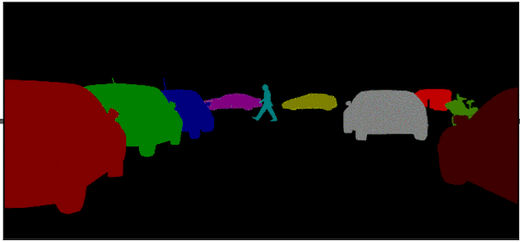
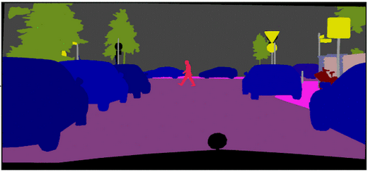

## Panoptic segmentation in Hugging Face mask2former

## Convert label-studio segmentation to panoptic segmentation 

### Semantic Segmentation vs. Instance Segmentation vs. Panoptic Segmentation


Based on their core functionality, the three types of segmentation are semantic, instance, and panoptic.




Semantic segmentation is only interested in the classes of objects, not individual objects. Each segment corresponds to one class covering the objects of that class, even if they're far apart in the scene. It assigns a class label to each pixel and uses the same class label for the pixels of any object of that class. Each segment is output as an image-sized overlay mask covering all the pixels of that class.



Instance or object segmentation not only identifies the classes but also differentiates each object within a class. Each segment corresponds to an individual object instance. It assigns both a class label and a unique object identifier to each pixel. Uncountable background elements, like the sky or the ground, are usually ignored.



Panoptic segmentation just combines semantic and instance segmentation. Like instance segmentation, it differentiates each object within a class. Like semantic segmentation, it labels the background elements, too.


### Input data Label studio segmentation --> Out is pickle file with panoptic seg

**input:**  
label studio json file
+  
and list of images

**output schem pickle:**
```
schem panoptic_seg_gt

panoptic_seg_gt = {
                   "GX010032_8.jpg"
                           :{"panoptic_mask": np.ndarray,
                              "inst2class": dict_inst2class},
                   "GX010034_10.jpg"
                           :{"panoptic_mask": np.ndarray,
                              "inst2class": dict_inst2class},
#                   .....
#                   .....
                   "GX010034_14.jpg"
                           :{"panoptic_mask": np.ndarray,
                              "inst2class": dict_inst2class}
                  }

panoptic_mask = (
      [[  43,   43,   43, ...,   98,   98,   98],
       [  7,    43,   43, ...,   67,   98,   98],
       [  7,     7,    7, ...,   67,   98,   98],
       ...,
       [  139,   139,   139, ..., 108, 108, 108],
       [  19,     19,   139, ..., 108, 108, 108],
       [  19,     19,   139, ..., 108, 108, 108]], dtype=uint32)

panoptic_mask.shape = np.array (x,y)


inst2class = {43:  2,  7: 0,
              98:  3, 67: 1, 
              .....
              139: 1, 108: 2}

## not nescseary
id2label = {0: 'leaf', 
            1: 'stem', 
            2: 'tomato', 
            3: 'background'}
```

## IT IS SO IMPORTANT TO ADD CLASS BACKGROUND

## or larger 

```
schem panoptic_seg_gt

panoptic_seg_gt = {
                   "GX010032_8.jpg"
                           :{"panoptic_mask": np.ndarray,
                              "inst2class": dict_inst2class},
                   "GX010034_10.jpg"
                           :{"panoptic_mask": np.ndarray,
                              "inst2class": dict_inst2class},
#                   .....
#                   .....
                   "GX010034_14.jpg"
                           :{"panoptic_mask": np.ndarray,
                              "inst2class": dict_inst2class}
                  }

panoptic_mask = (
      [[  43,   43,   43, ...,   98,   98,   98],
       [  7,    43,   43, ...,   67,   98,   98],
       [  7,     7,    7, ...,   67,   98,   98],
       ...,
       [  139,   139,   139, ..., 108, 108, 108],
       [  19,     19,   139, ..., 108, 108, 108],
       [  19,     19,   139, ..., 108, 108, 108]], dtype=uint32)

panoptic_mask.shape = np.array (x,y)


inst2class = {43:  2,  7: 5,
              98:  30, 67: 5, 
              .....
              139: 17, 108: 11}

## not nescseary
id2label = {0: 'wall', 1: 'building', 2: 'sky', 3: 'floor', 4: 'tree', 5: 'ceiling', 6: 'road', 7: 'bed ', 8: 'windowpane', 
            9: 'grass', 10: 'cabinet', 11: 'sidewalk', 12: 'person', 13: 'earth', 14: 'door', 15: 'table', 16: 'mountain', 
            17: 'plant', 18: 'curtain', 19: 'chair', 20: 'car', 21: 'water', 22: 'painting', 23: 'sofa', 24: 'shelf', 25: 'house', 
            26: 'sea', 27: 'mirror', 28: 'rug', 29: 'field', 30: 'armchair', 31: 'seat', 32: 'fence', 33: 'desk', 34: 'rock', 
            35: 'wardrobe', 36: 'lamp', 37: 'bathtub', 38: 'railing', 39: 'cushion', 40: 'base', 41: 'box', 42: 'column', 
            43: 'signboard', 44: 'chest of drawers', 45: 'counter', 46: 'sand', 47: 'sink', 48: 'skyscraper', 49: 'fireplace', 
            50: 'refrigerator', 51: 'grandstand', 52: 'path', 53: 'stairs', 54: 'runway', 55: 'case', 56: 'pool table', 57: 'pillow', 
            58: 'screen door', 59: 'stairway', 60: 'river', 61: 'bridge', 62: 'bookcase', 63: 'blind', 64: 'coffee table', 65: 'toilet', 
            66: 'flower', 67: 'book', 68: 'hill', 69: 'bench', 70: 'countertop', 71: 'stove', 72: 'palm', 73: 'kitchen island', 74: 'computer', 
            75: 'swivel chair', 76: 'boat', 77: 'bar', 78: 'arcade machine', 79: 'hovel', 80: 'bus', 81: 'towel', 82: 'light', 83: 'truck', 
            84: 'tower', 85: 'chandelier', 86: 'awning', 87: 'streetlight', 88: 'booth', 89: 'television receiver', 90: 'airplane', 
            91: 'dirt track', 92: 'apparel', 93: 'pole', 94: 'land', 95: 'bannister', 96: 'escalator', 97: 'ottoman', 98: 'bottle', 
            99: 'buffet', 100: 'poster', 101: 'stage', 102: 'van', 103: 'ship', 104: 'fountain', 105: 'conveyer belt', 106: 'canopy', 
            107: 'washer', 108: 'plaything', 109: 'swimming pool', 110: 'stool', 111: 'barrel', 112: 'basket', 113: 'waterfall', 114: 'tent', 
            115: 'bag', 116: 'minibike', 117: 'cradle', 118: 'oven', 119: 'ball', 120: 'food', 121: 'step', 122: 'tank', 123: 'trade name', 
            124: 'microwave', 125: 'pot', 126: 'animal', 127: 'bicycle', 128: 'lake', 129: 'dishwasher', 130: 'screen', 131: 'blanket', 
            132: 'sculpture', 133: 'hood', 134: 'sconce', 135: 'vase', 136: 'traffic light', 137: 'tray', 138: 'ashcan', 139: 'fan', 
            140: 'pier', 141: 'crt screen', 142: 'plate', 143: 'monitor', 144: 'bulletin board', 145: 'shower', 146: 'radiator', 147: 'glass', 
            148: 'clock', 149: 'flag'}
```